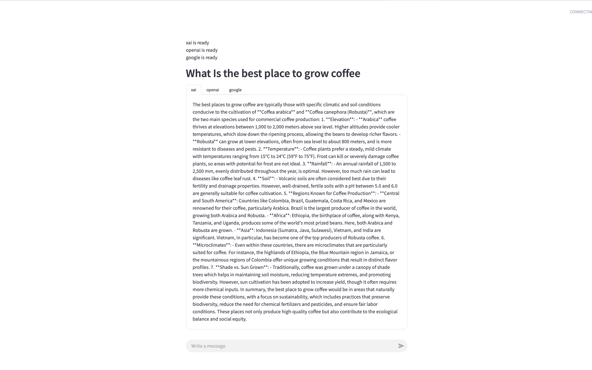

# Low Code Chat UI
Compare multiple AI models responses between tabs. No chat history.

&nbsp;

<div align="center"></div>

&nbsp;

## Repository Structure
```

chat-comparison/
├── aitools.py
├── chat.py
├── preview.gif
├── requirements.txt
├── setup.sh
├── start.sh
```

&nbsp;

## Run this demo locally
```
git clone https://github.com/BrianLesko/chat-comparison.git
cd chat-comparison
sudo chmod +x setup.sh
./setup.sh
./start.sh
```

&nbsp;

<hr>

&nbsp;

<div align="center">


╭━━╮╭━━━┳━━┳━━━┳━╮╱╭╮        ╭╮╱╱╭━━━┳━━━┳╮╭━┳━━━╮
┃╭╮┃┃╭━╮┣┫┣┫╭━╮┃┃╰╮┃┃        ┃┃╱╱┃╭━━┫╭━╮┃┃┃╭┫╭━╮┃
┃╰╯╰┫╰━╯┃┃┃┃┃╱┃┃╭╮╰╯┃        ┃┃╱╱┃╰━━┫╰━━┫╰╯╯┃┃╱┃┃
┃╭━╮┃╭╮╭╯┃┃┃╰━╯┃┃╰╮┃┃        ┃┃╱╭┫╭━━┻━━╮┃╭╮┃┃┃╱┃┃
┃╰━╯┃┃┃╰┳┫┣┫╭━╮┃┃╱┃┃┃        ┃╰━╯┃╰━━┫╰━╯┃┃┃╰┫╰━╯┃
╰━━━┻╯╰━┻━━┻╯╱╰┻╯╱╰━╯        ╰━━━┻━━━┻━━━┻╯╰━┻━━━╯
  


&nbsp;


<a href="https://twitter.com/BrianJosephLeko"></a> &nbsp; &nbsp; &nbsp; &nbsp; &nbsp; &nbsp; <a href="https://github.com/BrianLesko"></a> &nbsp; &nbsp; &nbsp; &nbsp; &nbsp; &nbsp; <a href="https://www.linkedin.com/in/brianlesko/"></a>

follow all of these for pizza :)

</div>


&nbsp;


